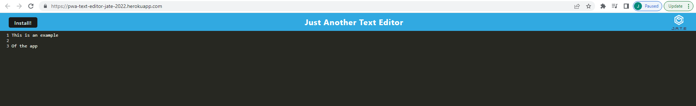

# Progressive Web Application Text Editor


## User Story

```md
AS A developer
I WANT to create notes or code snippets with or without an internet connection
SO THAT I can reliably retrieve them for later use
```

## Description

A single-page text editor that runs in both the browser and functions offline. This text editor leverages webpack, service workers, and IndexedDB to create a text editor that can be installed locally on a machine, modified while offline, and persist data when the user is reconnected to the network. This application also meets the following acceptance criteria:

```md
GIVEN a text editor web application
WHEN I open my application in my editor
THEN I should see a client server folder structure
WHEN I run `npm run start` from the root directory
THEN I find that my application should start up the backend and serve the client
WHEN I run the text editor application from my terminal
THEN I find that my JavaScript files have been bundled using webpack
WHEN I run my webpack plugins
THEN I find that I have a generated HTML file, service worker, and a manifest file
WHEN I use next-gen JavaScript in my application
THEN I find that the text editor still functions in the browser without errors
WHEN I open the text editor
THEN I find that IndexedDB has immediately created a database storage
WHEN I enter content and subsequently click off of the DOM window
THEN I find that the content in the text editor has been saved with IndexedDB
WHEN I reopen the text editor after closing it
THEN I find that the content in the text editor has been retrieved from our IndexedDB
WHEN I click on the Install button
THEN I download my web application as an icon on my desktop
WHEN I load my web application
THEN I should have a registered service worker using workbox
WHEN I register a service worker
THEN I should have my static assets pre cached upon loading along with subsequent pages and static assets
WHEN I deploy to Heroku
THEN I should have proper build scripts for a webpack application
```

Opening the text editor looks as follows:



The following link leads to a deployed version of the application on Heroku:

https://pwa-text-editor-jate-2022.herokuapp.com/

## Table of Contents

- [Installation](#installation)
- [Usage](#usage)
- [Credits](#credits)
- [Contribute](#contribute)
- [Tests](#tests)
- [Questions](#questions)
- [License](#license)

## Installation

The following packages need to be installed in order to run the application:

Code-mirror-themes: https://www.npmjs.com/package/code-mirror-themes

Express: https://www.npmjs.com/package/express

Idb: https://www.npmjs.com/package/idb 

If-env: https://www.npmjs.com/package/if-env

These packages can be installed using the command from the root directory:

```md
npm i
```

## Usage

This program can be downloaded and used by anyone. To run the application, use the following commands:

First, follow the installation steps listed above. Once the installation is done, build and run the application by running the following commands:

```md
npm run build
```

Finally, text editor can be used locally through localhost, or can be installed locally:

http://localhost:3000/

## Credits

This following packages are credited with helping create this application:

Code-mirror-themes is used for generating an online editor: https://www.npmjs.com/package/code-mirror-themes

Express is used as a web routing framework: https://www.npmjs.com/package/express

Idb is used for making use of IndexedDB easier: https://www.npmjs.com/package/idb 

If-env is used as a script modifier: https://www.npmjs.com/package/if-env

## Contribute

This is a completed application and does not need any contributions.

## Tests

There is no testing for this application.

## Questions

Feel free to reach out to me with questions:

Find my GitHub at: [GitHub Profile](https://github.com/cornetj13)

Email me at: cornetj2@gmail.com

## License

This source code is licensed under the MIT license found in the LICENSE file in the root directory of this source tree.
